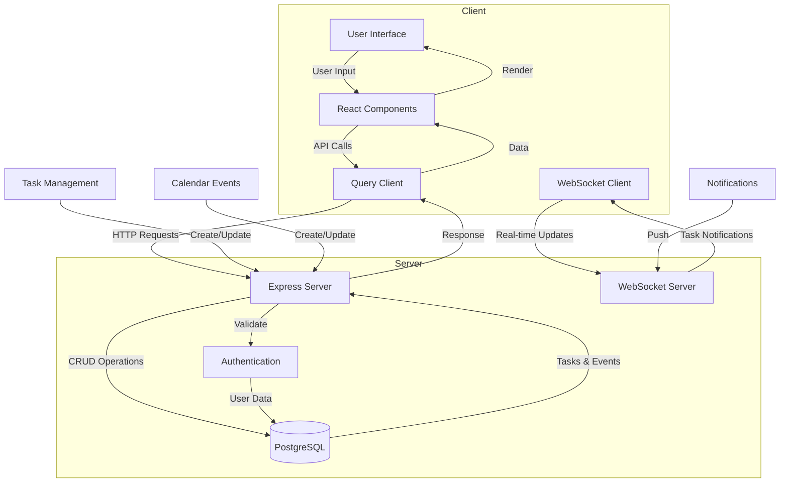

# Annah System Architecture

## Flow Description

1. **Authentication Flow**
   - User credentials → Auth → Database verification
   - JWT session management

2. **Task Management Flow**
   - Create/Update tasks → API → Database
   - Real-time updates via WebSocket

3. **Calendar Flow**
   - Event creation → API → Database
   - Event retrieval and display

4. **Notification Flow**
   - Server monitors tasks
   - WebSocket pushes notifications
   - Browser notifications displayed
