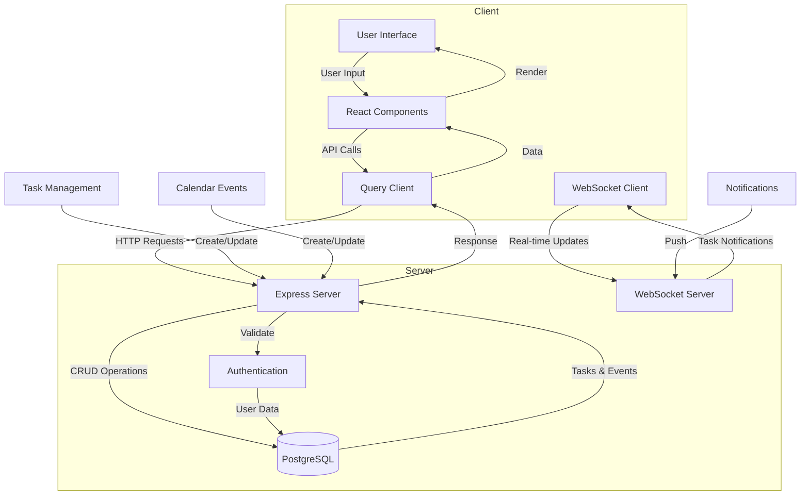

# Annah - Technical Documentation

## System Architecture



## System Components

### Frontend Architecture
- **Framework**: React with TypeScript
- **State Management**: TanStack Query
- **Styling**: Tailwind CSS + shadcn/ui
- **Real-time**: WebSocket client integration

Key Components:
- `App.tsx`: Application router
- `auth-page.tsx`: Authentication interface
- `home-page.tsx`: Main dashboard
- UI Components: Drawer, Command, Sidebar, Charts

### Backend Architecture
- **Server**: Express.js with TypeScript
- **Database**: PostgreSQL with Drizzle ORM
- **Authentication**: JWT-based
- **Real-time**: WebSocket server

### Core Features

1. **Authentication System**
   - JWT-based session management
   - Secure password handling
   - Protected route middleware

2. **Task Management**
   - CRUD operations
   - Real-time updates
   - Due date tracking
   - Task categorization

3. **Calendar Integration**
   - Event scheduling
   - Date/time management
   - Recurring events support

4. **Real-time Notifications**
   - WebSocket-based updates
   - Browser notifications
   - Task reminders

## API Endpoints

```typescript
// Authentication
POST /api/register     // User registration
POST /api/login        // User authentication
POST /api/logout       // User logout
GET  /api/user         // Get current user

// Task Management
GET    /api/tasks      // List tasks
POST   /api/tasks      // Create task
PUT    /api/tasks/:id  // Update task
DELETE /api/tasks/:id  // Delete task

// Calendar
GET    /api/events     // List events
POST   /api/events     // Create event
PUT    /api/events/:id // Update event
DELETE /api/events/:id // Delete event
```

## Data Flow

1. **Authentication Flow**
   - Client submits credentials
   - Server validates and issues JWT
   - Token stored in secure HTTP-only cookie
   - Protected routes verify token

2. **Task Management Flow**
   - Create/Update tasks via API
   - Real-time sync via WebSocket
   - Automatic notifications
   
3. **Calendar Management**
   - Event creation with validation
   - Real-time calendar updates
   - Recurring event handling

## Development Setup

1. **Environment**
   - Node.js runtime
   - PostgreSQL database
   - Development port: 5000

2. **Running the Application**
   ```bash
   npm run dev
   ```

3. **Build Process**
   ```bash
   npm run build
   ```

## Security Considerations

- Password hashing with scrypt
- JWT-based session management
- CSRF protection
- Secure WebSocket connections
- Input validation using Zod
- SQL injection prevention via ORM

## Performance Optimizations

- React Query caching
- Optimistic updates
- WebSocket connection pooling
- Database indexing
- Lazy loading components

This documentation provides a comprehensive overview of the Annah personal assistant application architecture and implementation details.
